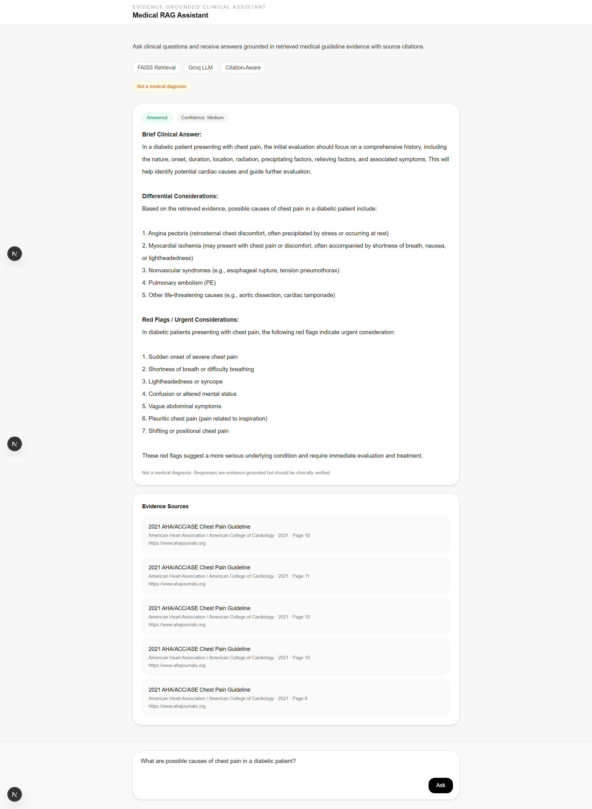
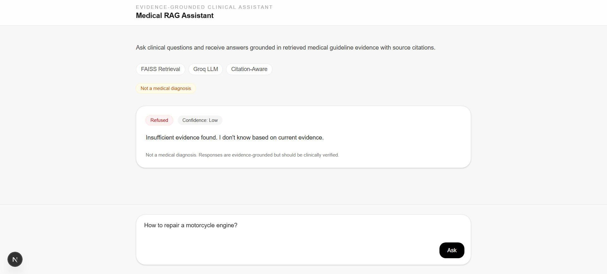
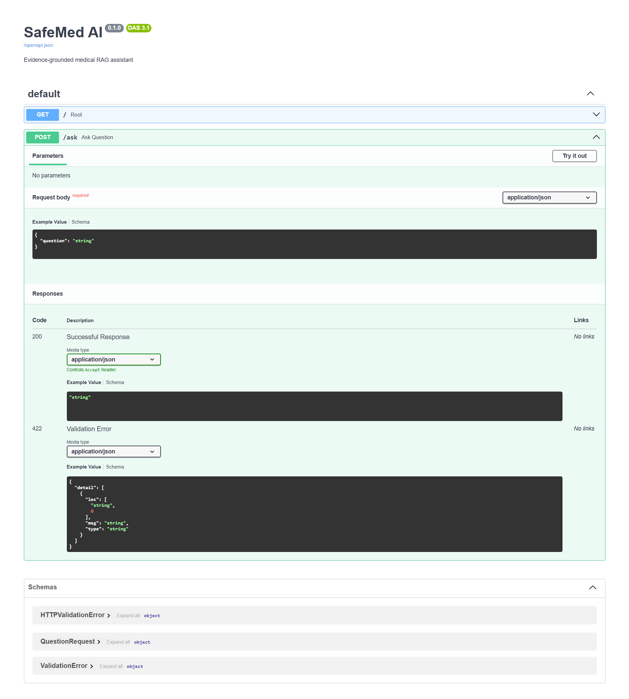

# Medical RAG Assistant

A safety-first, evidence-grounded medical RAG prototype built for a healthcare/pharma AI assignment.

The assistant answers clinical-style questions by retrieving relevant evidence from trusted medical guideline PDFs, generating a concise response, showing source citations, and refusing to answer when evidence is weak or unrelated.

## Why This Project

In pharma and healthcare settings, AI systems cannot rely only on model memory. Unsupported or hallucinated answers can create serious safety, compliance, and trust risks.

This project focuses on building a practical clinical information assistant where every answer is grounded in retrieved evidence.

The goal is to demonstrate:

- safe AI system design
- retrieval-augmented generation
- hallucination prevention
- citation-backed responses
- confidence-aware refusal
- practical engineering tradeoffs for healthcare AI

## Demo Screenshots

### Evidence-Grounded Clinical Response



---

### Refusal for Irrelevant / Unsafe Query



---

### FastAPI Backend API Docs



## Core Features

- PDF-based medical document ingestion
- Text extraction and semantic chunking
- FAISS vector retrieval
- Evidence-grounded answer generation
- Groq-powered open-source LLM inference
- Confidence scoring
- Refusal mechanism for weak retrieval
- Citation-aware responses
- FastAPI backend API
- Next.js frontend interface

## Tech Stack

### Frontend

- Next.js
- React
- Tailwind CSS

### Backend

- FastAPI
- Python
- Pydantic

### RAG / Retrieval

- LangChain
- FAISS
- Sentence Transformers embeddings
- PyPDF for PDF text extraction

### LLM

- Groq API
- Open-source LLM inference via Groq

## Architecture

```txt
Medical Guideline PDFs
        ↓
PDF Text Extraction
        ↓
Text Chunking
        ↓
Embedding Generation
        ↓
FAISS Vector Store
        ↓
Semantic Retrieval
        ↓
Confidence / Refusal Check
        ↓
Groq LLM
        ↓
Evidence-Grounded Answer + Citations
```

## How It Works

### 1. PDF Ingestion

Trusted medical guideline PDFs are stored locally and processed using PyPDF.

Examples:

- chest pain guidelines
- hypertension guidelines
- cardiovascular disease guidance
- diabetes standards of care

### 2. Text Chunking

Extracted text is divided into overlapping chunks using recursive character splitting.

This improves:

- semantic retrieval quality
- context preservation
- retrieval precision

### 3. Embedding Generation

Each chunk is converted into vector embeddings using Sentence Transformers.

These embeddings are stored inside a local FAISS vector database.

### 4. Semantic Retrieval

When a user asks a question:

- the query is embedded
- similar medical chunks are retrieved from FAISS
- top evidence matches are selected

### 5. Confidence & Safety Check

Retrieved similarity scores are analyzed to determine:

- retrieval confidence
- whether evidence is sufficiently relevant

If evidence is weak or unrelated, the assistant refuses to answer.

### 6. Evidence-Grounded Generation

The retrieved clinical evidence is passed to the LLM through a constrained prompt.

The model is instructed to:

- answer only from retrieved evidence
- avoid unsupported claims
- avoid hallucinated medical advice
- refuse when uncertain

### 7. Citation-Aware Response

Responses include:

- source title
- organization
- publication year
- page number
- source URL

This improves transparency and traceability of generated responses.

## Hallucination Prevention

This project uses multiple safety layers to reduce unsupported medical responses.

### 1. Trusted Source Ingestion

Only selected medical guideline PDFs and trusted clinical documents are indexed into the vector store.

### 2. Retrieval Grounding

The LLM does not answer directly from model memory.  
It receives only retrieved clinical evidence as context before generating an answer.

### 3. Confidence Thresholding

FAISS retrieval scores are converted into simple confidence labels:

- High
- Medium
- Low

### 4. Refusal Mechanism

If retrieval confidence is weak or the query is unrelated to indexed medical evidence, the assistant refuses to answer.

Example:

```txt
Insufficient evidence found.
I don't know based on current evidence.
```

### 5. Citation Enforcement

Every response includes:

- document title
- source organization
- publication year
- page number
- source URL

This helps users trace generated answers back to supporting clinical evidence.

````

## Example Queries

### Accepted Query

```txt
What are possible causes of chest pain in a diabetic patient?
````

Expected behavior:

- retrieves relevant clinical evidence
- generates evidence-grounded response
- shows confidence score
- displays citations

---

### Refusal Query

```txt
How to repair a motorcycle engine?
```

Expected behavior:

- detects irrelevant retrieval
- refuses to answer
- avoids hallucinated output

## API Endpoint

### POST `/ask`

Request:

```json
{
  "question": "What are possible causes of chest pain in a diabetic patient?"
}
```

Response:

```json
{
  "answer": "...",
  "confidence": {
    "label": "Medium",
    "value": 0.7
  },
  "refused": false,
  "sources": []
}
```

## Running Locally

### Backend

```bash
cd backend
pip install -r requirements.txt
uvicorn app.main:app --reload
```

Backend runs on:

```txt
http://127.0.0.1:8000
```

FastAPI docs:

```txt
http://127.0.0.1:8000/docs
```

---

### Frontend

```bash
cd frontend
npm install
npm run dev
```

Frontend runs on:

```txt
http://localhost:3000
```

## Environment Variables

Create `backend/.env`:

```env
GROQ_API_KEY=your_groq_api_key
GROQ_MODEL=llama-3.1-8b-instant
```

## Tradeoffs

- Used FAISS instead of a hosted vector database for local simplicity.
- Used Groq-hosted open-source models for faster inference and lightweight deployment.
- Initial local model experimentation was considered using Ollama-hosted models.
- This project focuses on safe retrieval and grounded generation instead of full clinical diagnosis workflows.

## Future Improvements

- better guideline ranking
- source diversity enforcement
- support for fully offline/local inference using Ollama-hosted open-source models such as Llama or Mistral for privacy-sensitive healthcare environments
- audit logging
- medical entity extraction
- multi-document reasoning
- human-in-the-loop validation
- EHR integration

## Medical Disclaimer

This project is an educational prototype and not a clinically validated diagnostic system.

Responses should not be used as a replacement for professional medical judgment.
